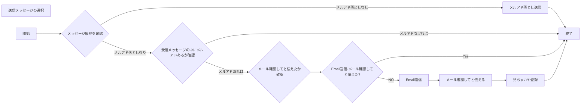

```mermaid

graph LR
    title[送信メッセージの選択]
    A[開始] --> B{メッセージ履歴を確認}
	B -->|メルアド落としなし| C[メルアド落とし送信]
	C --> D[終了]
    B -->|メルアド落とし有り| E{受信メッセージの中にメルアドあるか確認}
    E -->|メルアドなければ| D
    E -->|メルアドあれば| F{メール確認してと伝えたか確認}
    F --> G{Email送信-メール確認してと伝えた?}
    G -->|Yes| D
    G -->|NO| H[Email送信]
    H --> I[メール確認してと伝える]
    I --> J[見ちゃいや登録]
    J --> D


```